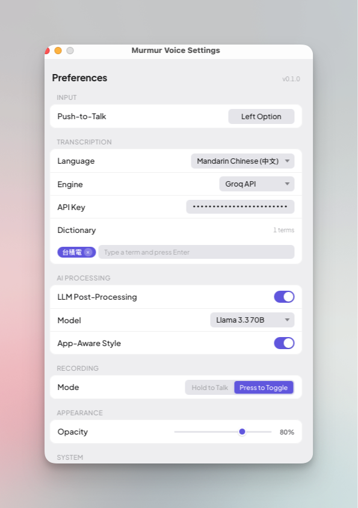
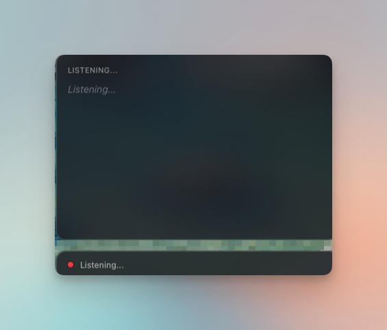

# Murmur

[](https://github.com/panda850819/murmur-voice/releases)
[](https://github.com/panda850819/murmur-voice/actions/workflows/ci.yml)
[](LICENSE)
[]()

**[English](README.md)** | **[繁體中文](README.zh-TW.md)**

> Your voice, unheard by others.

Privacy-first voice-to-text for macOS and Windows, built with Rust.

<p align="center">
  
  
</p>

## What is Murmur?

Murmur is a voice dictation tool that transcribes your speech and inserts polished text at your cursor position -- in any app. It supports both local (on-device) and cloud transcription, with optional LLM post-processing to clean up filler words, fix punctuation, and convert Simplified Chinese to Traditional Chinese.

## Features

- **Push-to-Talk** -- Hold a modifier key to speak, release to insert text
- **Toggle Mode** -- Press once to start recording, press again to stop (with 5-min auto-stop)
- **Custom Hotkey** -- Choose any modifier key (Option, Command, Shift, Control, left or right)
- **Dual Engine** -- Local Whisper (Metal GPU) or Groq cloud API
- **LLM Post-Processing** -- Clean up filler words, add punctuation, Simplified-to-Traditional Chinese conversion via Groq LLM
- **App-Aware Style** -- Automatically adjusts output tone based on the active app (e.g. formal in Slack, technical in VS Code)
- **Personal Dictionary** -- Add custom terms to improve transcription accuracy
- **Transcription Preview** -- Floating preview window shows full transcription result with live updates, character count, and detected app name
- **Live Preview** -- See partial transcription while you speak (local engine only)
- **15 Languages** -- Auto-detect or manually select from 15 supported languages
- **Cross-Platform** -- macOS and Windows support with platform-native hotkey and app detection
- **System-wide** -- Works in any text field across all apps
- **Lightweight** -- Tauri-based, ~30-50MB vs 200MB+ Electron apps
- **Open Source** -- Fully auditable, no telemetry, no tracking

## Download

Download the latest release from the [Releases page](https://github.com/panda850819/murmur-voice/releases).

| Platform | File | Notes |
|----------|------|-------|
| macOS (Apple Silicon) | `.dmg` | Requires [quarantine removal](#macos-murmur-voice-is-damaged-and-cant-be-opened) |
| Windows | `.exe` / `.msi` | CPU-only, works on all hardware |
| Windows (NVIDIA GPU) | `-cuda.exe` / `-cuda.msi` | GPU-accelerated via CUDA |

## How It Works

```
Hotkey -> Record (cpal) -> Transcribe (Whisper) -> LLM Clean-up (optional) -> Paste at cursor
```

**Each recording triggers at most 2 API calls** (when using Groq): one for Whisper transcription, one for LLM post-processing.

## Setup Guide

### 1. Install & Run

```bash
git clone https://github.com/panda850819/murmur-voice.git
cd murmur-voice
pnpm install
pnpm tauri dev
```

### 2. First Launch

On first launch, Murmur will guide you through:
1. Granting **Microphone** and **Accessibility** permissions
2. Downloading the Whisper model (~800MB, one-time)
3. Setting your Push-to-Talk key

### 3. Transcription Engine

| Engine | Speed | Quality | Privacy | Setup |
|--------|-------|---------|---------|-------|
| **Local (Whisper)** | ~1-3s | Good | Audio stays on device | Download model (~800MB) |
| **Groq API** | <1s | Good | Audio sent to Groq servers | Free API key from [console.groq.com](https://console.groq.com) |

To switch engines: **Settings > Transcription > Engine**

### 4. LLM Post-Processing (Recommended)

Requires a **Groq API key** (same key used for both Whisper and LLM).

What it does:
- Removes filler words (um, uh, etc.)
- Removes false starts and self-corrections
- Adds proper punctuation (full-width for Chinese, half-width for English)
- Converts Simplified Chinese to Traditional Chinese (Taiwan standard)
- Adds spaces between Chinese and English text
- Formats lists and paragraphs when appropriate

To enable: **Settings > AI Processing > LLM Post-Processing**

### 5. Personal Dictionary

Add frequently used terms (names, jargon, acronyms) to improve transcription accuracy. These are injected into Whisper's initial prompt.

To configure: **Settings > Transcription > Dictionary** (type a term, press Enter to add)

### 6. App-Aware Style

When enabled, Murmur detects the foreground app and adjusts the LLM output tone:

| App | Style |
|-----|-------|
| Slack, Discord, LINE, Telegram | Casual |
| VS Code, Terminal, Cursor | Technical |
| Pages, Word, Google Docs | Formal |
| Others | Default (natural) |

To enable: **Settings > AI Processing > App-Aware Style**

## Recommended Settings

For the best experience with Chinese dictation:

| Setting | Value | Why |
|---------|-------|-----|
| Engine | **Groq** | Fastest transcription (<1s) |
| Language | **Mandarin Chinese** | More accurate than Auto for Chinese |
| LLM Post-Processing | **On** | Cleans up filler words + Traditional Chinese |
| LLM Model | **Llama 3.3 70B** | Best quality for Chinese text processing |
| App-Aware Style | **On** | Adapts tone to context |

## Tech Stack

| Component | Technology | Purpose |
|-----------|-----------|---------|
| App Framework | Tauri 2 | Lightweight desktop app |
| Audio Capture | cpal | Microphone input -> 16kHz mono |
| Speech-to-Text | whisper-rs / Groq API | Local or cloud transcription |
| LLM Processing | Groq API (Llama 3.3) | Text cleanup and formatting |
| Hotkey Detection | CGEventTap / SetWindowsHookEx | Global modifier key listener (per-platform) |
| Text Insertion | arboard + rdev | Clipboard write + Cmd+V / Ctrl+V simulation |
| App Detection | NSWorkspace / Win32 API | Foreground app detection (per-platform) |

## Requirements

### macOS
- macOS 12.0+ (Apple Silicon recommended for local Whisper)
- Microphone permission
- Accessibility permission (for global hotkey + text insertion)

### Windows
- Windows 10+
- Microphone permission

### Both Platforms
- Groq API key (free, for cloud engine and LLM features)

## FAQ

### macOS: "Murmur Voice is damaged and can't be opened"

This happens because the app is not signed with an Apple Developer certificate. macOS Gatekeeper quarantines unsigned apps by default. To fix:

1. Move Murmur Voice to `/Applications`
2. Open Terminal and run:
   ```bash
   xattr -d com.apple.quarantine /Applications/Murmur\ Voice.app
   ```
3. Open the app normally

### Windows: Which version should I download?

| Your GPU | Download | Why |
|----------|----------|-----|
| NVIDIA (with CUDA drivers) | `-cuda` version | GPU-accelerated transcription, much faster |
| AMD / Intel / integrated | Standard version | CPU transcription, works on all hardware |
| Not sure | Standard version | Always works, just slower for local engine |

### Why is the app unsigned?

Murmur is a free, open-source project. Apple Developer Program costs $99/year. Code signing may be added in the future, but for now the workaround above is required on macOS.

## Privacy

Murmur was born from a security audit of a commercial voice-to-text app that was found to:
- Capture browser URLs and window titles
- Monitor all keystrokes via CGEventTap
- Send application context to remote servers
- Include session recording analytics (Microsoft Clarity)

Murmur does none of this. When using the **local engine**, your audio never leaves your machine. When using **Groq**, audio is sent only to Groq's API for transcription -- no other data is collected or transmitted.

## License

MIT
